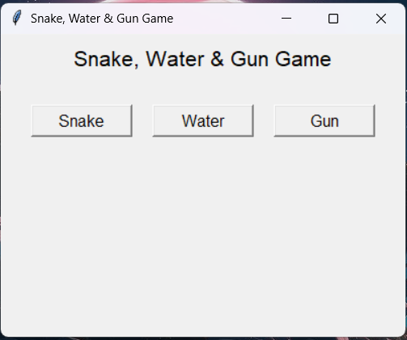

# 🐍 Snake-Water-Gun Game (Tkinter GUI)

A desktop GUI implementation of the classic Snake-Water-Gun game built using Python and Tkinter.

This project demonstrates conditional logic, dictionary mapping, randomization, and GUI event handling.

---

## 🎮 Game Rules

Snake-Water-Gun is a variation of Rock-Paper-Scissors:

- 🐍 Snake drinks Water → Snake wins
- 💧 Water damages Gun → Water wins
- 🔫 Gun kills Snake → Gun wins
- Same choice → Draw

The computer randomly selects an option, and the result is displayed instantly.

---

## 🖥️ Features

- Simple and clean Tkinter GUI
- Random computer move using `random.choice()`
- Win / Lose / Draw result display
- Button-based interaction
- Beginner-friendly Python project

---

## 🛠️ Tech Stack

- Python 3.x
- Tkinter (built-in GUI library)
- Random module

---

## 📂 Project Structure

```
Snake-Water-Gun-Game
│
├── assets/
├── src/
│   └── Game.py
├── README.md
├── requirements.txt
└── .gitignore
```

---

## ▶️ How to Run

1. Clone the repository:

```bash
git clone https://github.com/YOUR_USERNAME/Snake-Water-Gun-Game.git
```

2. Navigate to src folder:

```bash
cd Snake-Water-Gun-Game/src
```

3. Run the game:

```bash
python Game.py
```

---
## Preview

<p align="center">
  
  
</p>

## 📌 Concepts Used

- Dictionaries for mapping values
- Conditional statements
- Random number generation
- Tkinter GUI basics
- Event-driven programming

---

## 🚀 Future Improvements

- Add score tracking
- Add restart button
- Improve UI styling
- Add sound effects

---

## 👨‍💻 Author

**Souvik Banerjee**  
Computer Science Student